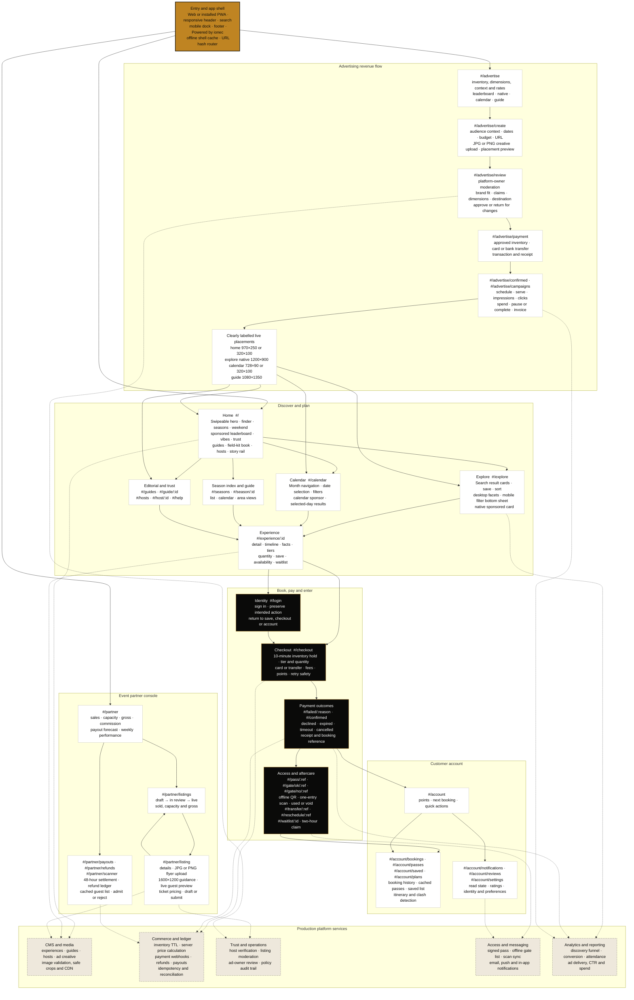

# NaijaGo platform architecture and journey map

This is the one-page map for product, design and engineering. Read it from top
to bottom: entry and discovery create intent; booking turns intent into a paid
pass; account and partner tools manage what happens after; platform services
make every client-side screen trustworthy. Solid arrows are user journeys.
Dotted arrows are service dependencies or moderation hand-offs.

## Implementation boundaries

- The prototype is client-side and in-memory; production must own inventory,
  prices, payment, pass signing, scan state, moderation and reporting on the
  server.
- Advertising payment occurs only after owner approval. A webhook—not the
  browser redirect—moves a campaign to paid and schedulable.
- Organic and paid ranking remain separate. Sponsored placements are explicit
  inventory slots and must retain the `Sponsored` or `Advertisement` label.
- The app shell can cache safely; personal and transactional responses require
  authenticated, scoped caching rules. A pass is cached at issuance.
